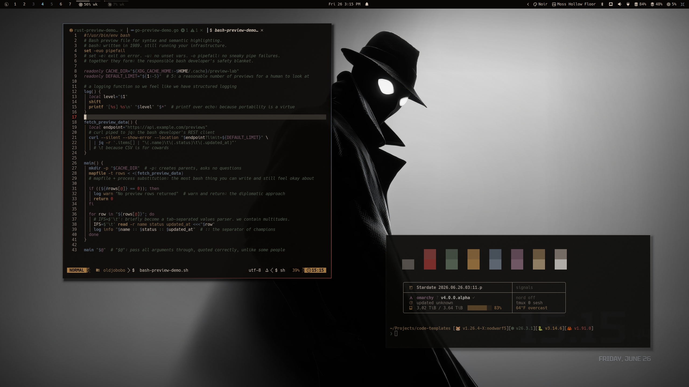

# Omarchy Noir Theme

A dark Omarchy theme with ink-black surfaces, parchment text, amber focus states, clay red warnings, moss green status color, smoked blue accents, and muted plum. It takes its cues from Spider-Noir imagery without narrowing the desktop to a character skin: low glow, sharp borders, deep shadows, and rain-dark wallpaper scenes.

## Preview


## Install

Use the Omarchy theme installer:

```bash
omarchy-theme-install https://github.com/OldJobobo/omarchy-noir-theme
```

## What's Included

- Base24 palette in `colors.toml` and `noir-base24.yaml`.
- Omarchy shell, Hyprland, Hyprlock, Walker, Mako, SwayOSD, GTK, Waybar, Chromium, icons, keyboard RGB, preview share picker, and Aether styling.
- Terminal palettes for Alacritty, Foot, Ghostty, Kitty, and Warp.
- App/editor ports for Neovim, Helix, VS Code, Zed, btop, Obsidian, Pi, Gum, and Vencord.
- 18 wallpapers in `backgrounds/`.

## Wallpapers

<table>
  <tr>
    <td>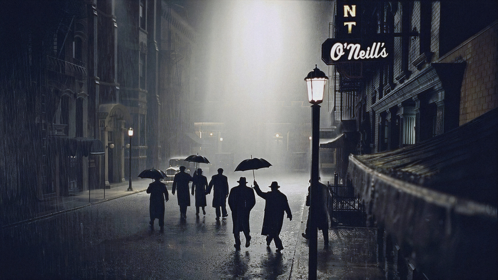</td>
    <td>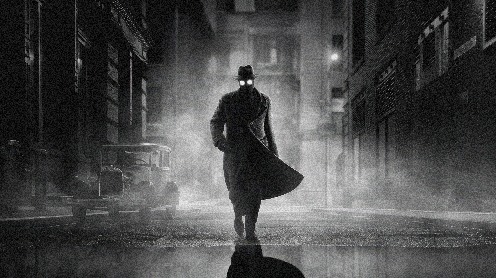</td>
    <td>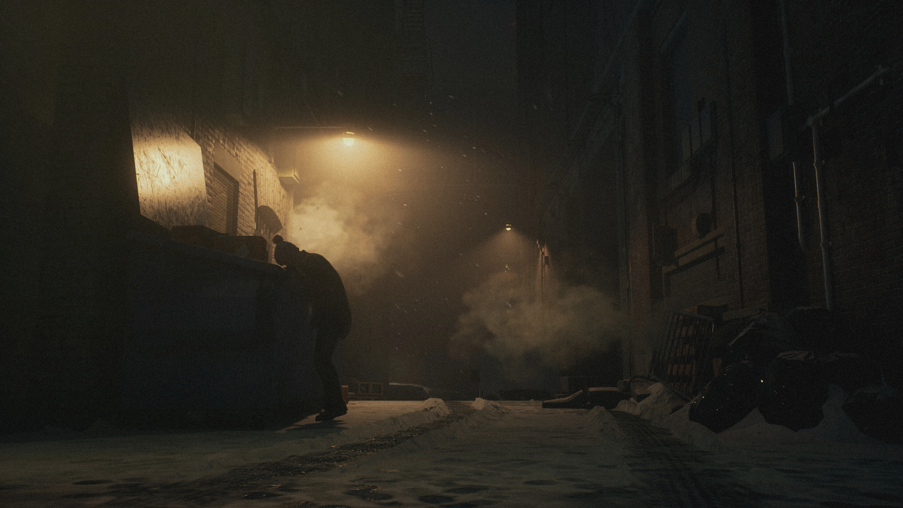</td>
  </tr>
  <tr>
    <td>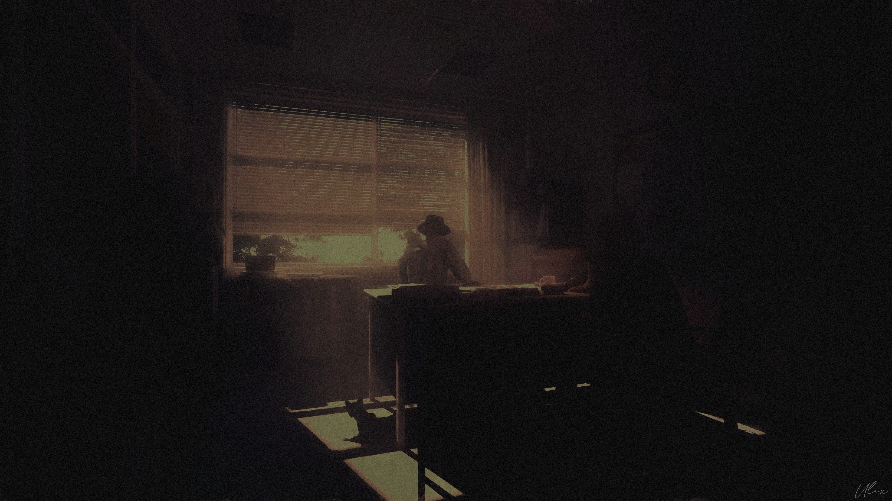</td>
    <td></td>
    <td>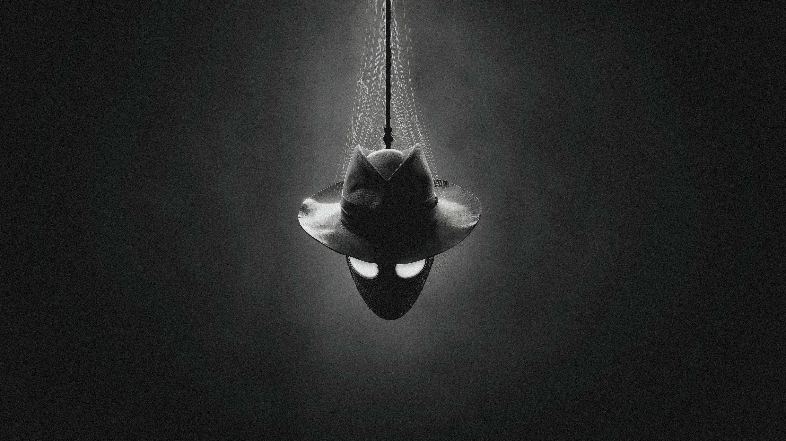</td>
  </tr>
  <tr>
    <td>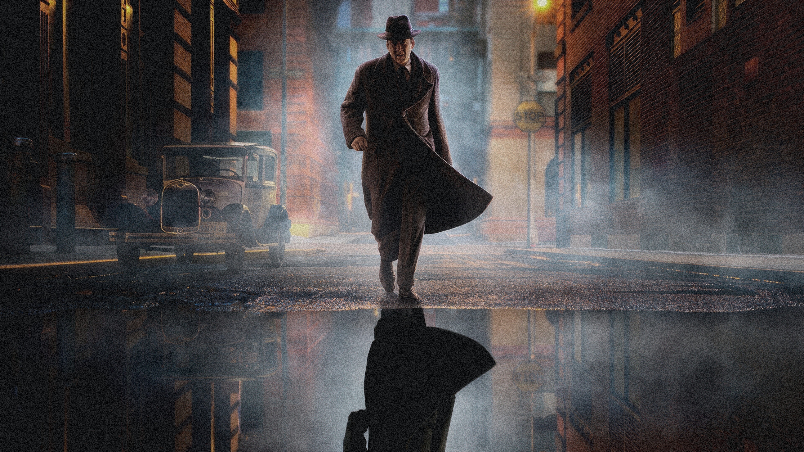</td>
    <td>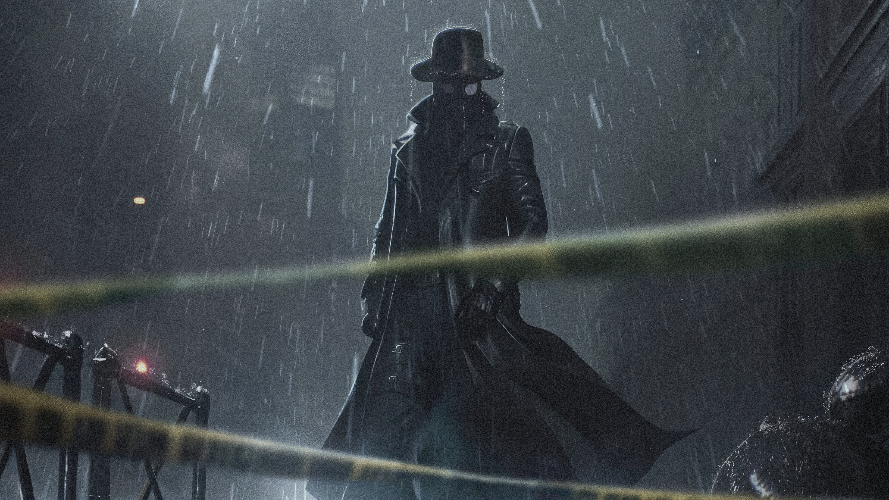</td>
    <td>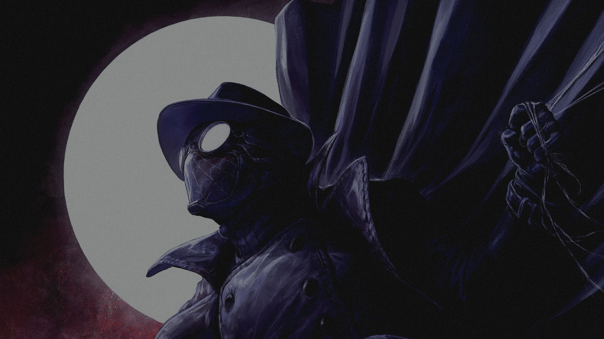</td>
  </tr>
  <tr>
    <td>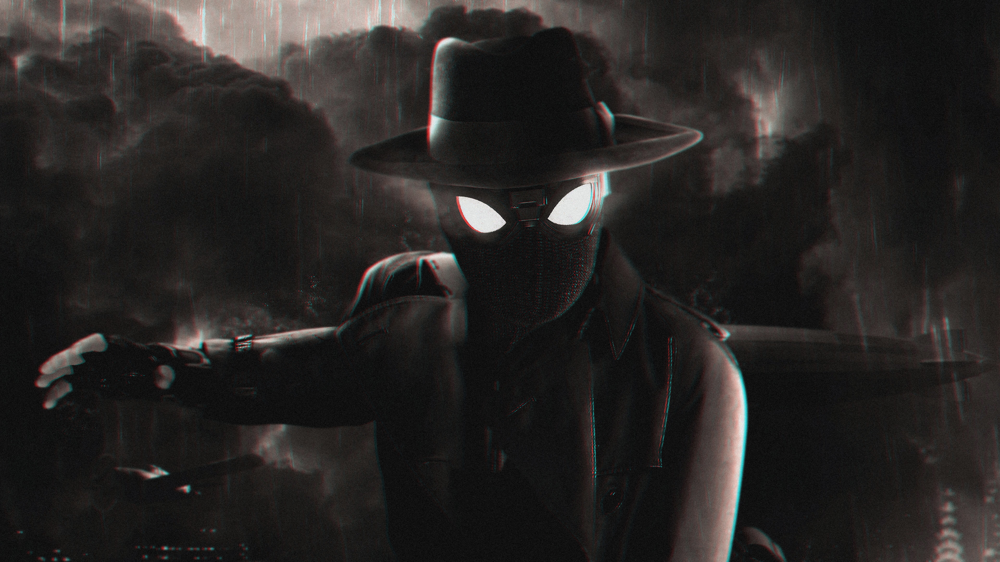</td>
    <td>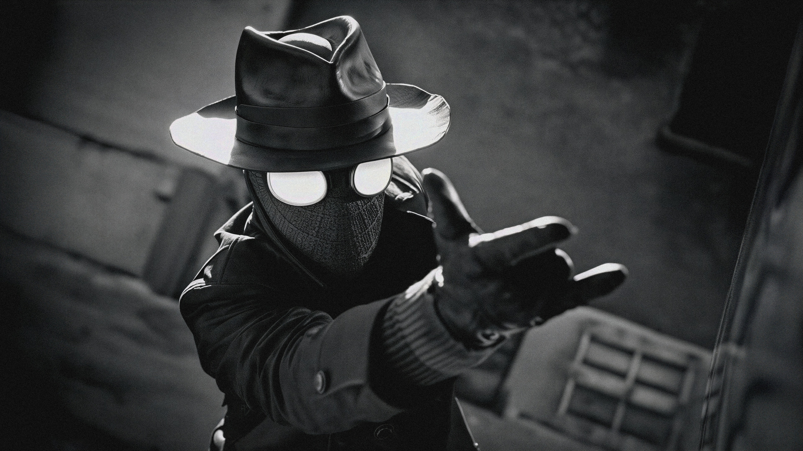</td>
    <td>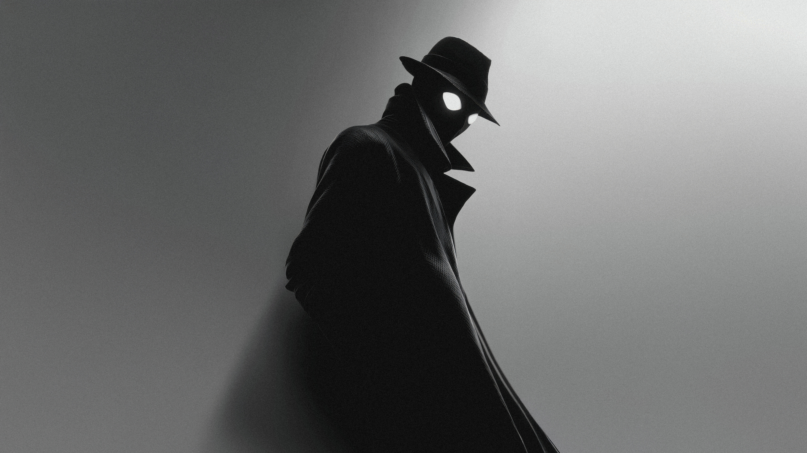</td>
  </tr>
  <tr>
    <td>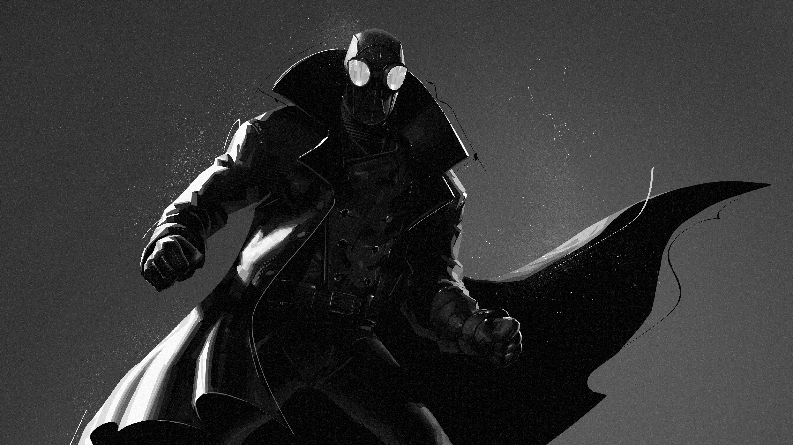</td>
    <td></td>
    <td></td>
  </tr>
  <tr>
    <td>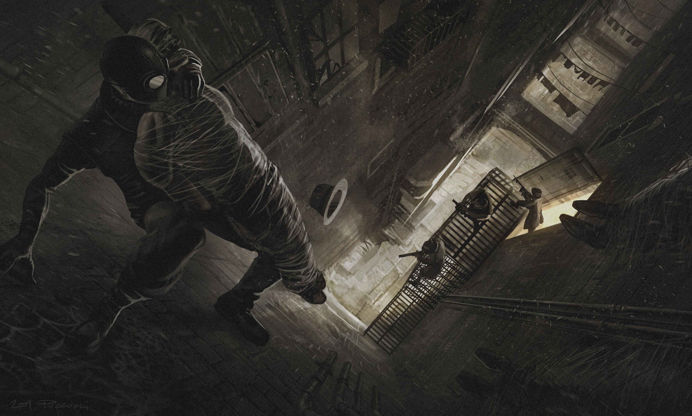</td>
    <td>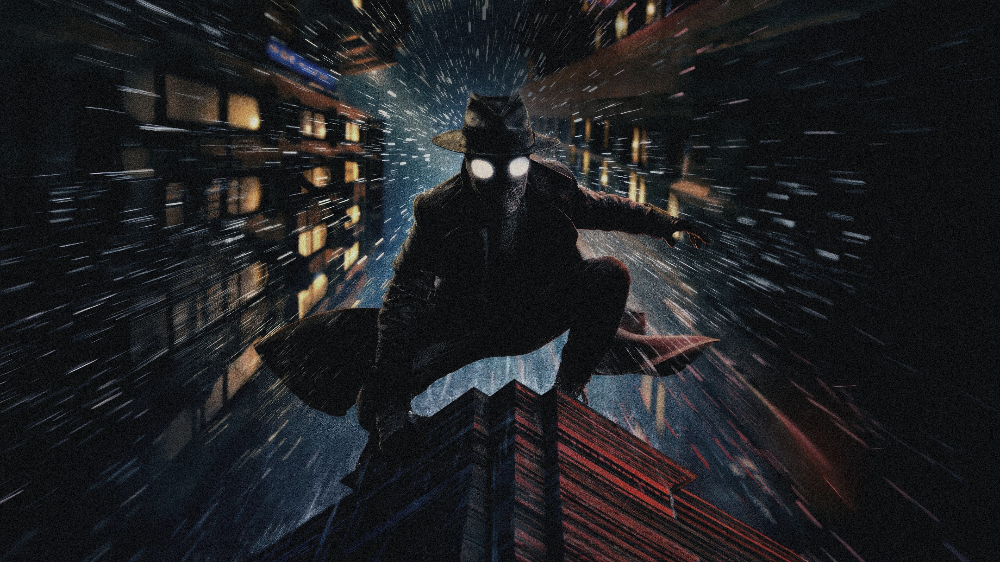</td>
    <td>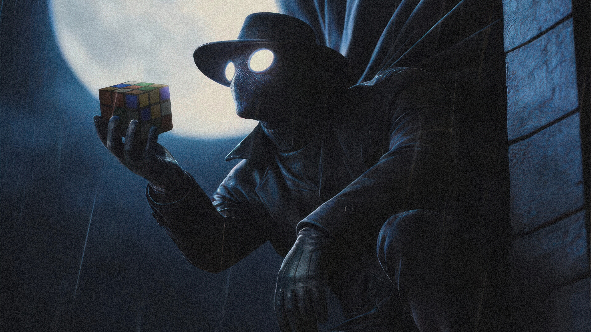</td>
  </tr>
</table>

## Notes

- `title.png` is used as the README banner; `preview.png` and `preview-2.png` are desktop previews.
- The Vencord theme imports `system24.css` from GitHub Pages, so Discord theming depends on that upstream stylesheet being reachable.

## Attribution

- Vencord styling builds on [refact0r/system24](https://github.com/refact0r/system24).
- Wallpaper imagery is Spider-Man Noir inspired. Spider-Man, Spider-Man Noir, and related characters are owned by Marvel.
- Wallpaper images are collected from publicly available internet wallpaper sources and are included for personal desktop theming.
